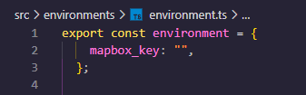

# MapsApp

Proyecto de mapas
URL del proyecto: [Maps APP](https://leonelvc19.github.io/maps_app).
Este proyecto se subio en GitHub Pages y fue creado en la seccion 21 del curso de angular

# Utilizar el proyecto.

* Clonar proyecto: `git clone https://github.com/leonelVc19/maps_app.git`
* Ir a ruta de descarga: `cd maps_app`
* Instalar Dependencias: `npm install`

# Inciar el proyecto
Se requiere de un Access Token de [MapBox](https://www.mapbox.com/)
* MAPBOX_KEY=your_mapbox_key

* Crear archivo .env y agregar Access Token

* Cuando inice el proyecto se creara la carpeta con el archivo de environments en:
`src/environments/environments.ts` con su Acces Token

Dicha carpeta sera generada con este codigo

* Ya configurado su Access Token, ejecutar
`ng s -o`
Para iniciar el proyecto

## Hola, soy Juan Leonel Vazquez Iglesias.

Desarrollador FullStack

Mi web[JLVI19C](https://jlvi19c.vercel.app/)
En esta web, encontrarás mi información de contacto así mismo como los proyectos en los que he trabajado.
